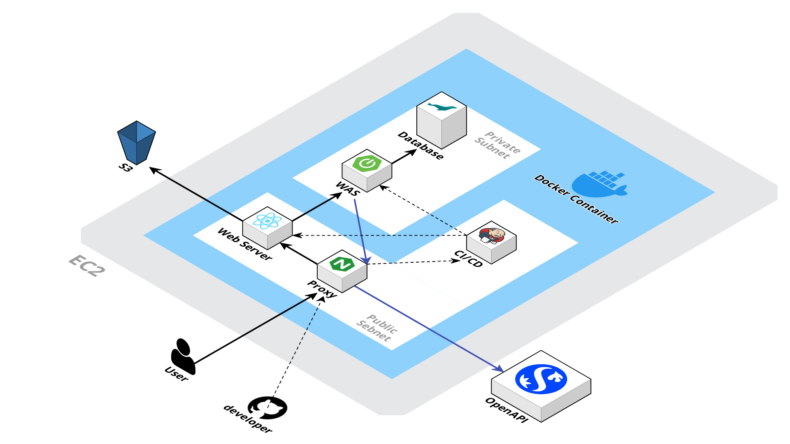
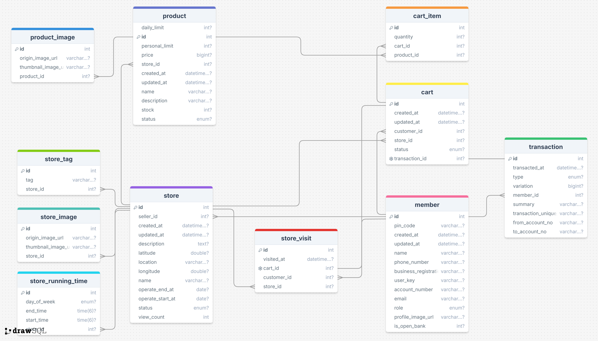

## SnapPick : 팝업스토어 특화 커머셜 모바일 앱

---

# 📌 SnapPick (스냅픽)

SnapPick은 팝업스토어를 손쉽게 관리하고 이용할 수 있는 금융 커머셜 모바일 애플리케이션입니다. 판매자는 자신만의 팝업스토어를 등록하고 관리할 수 있으며, 소비자는 간편하게 팝업스토어를 검색하고 상품을 구매할 수 있습니다. SnapPick을 통해 팝업스토어와 관련된 모든 것을 간편하게 해결하세요!

---

## 📋 목차

1. [**서비스 개요**](#🚀-서비스-개요)
2. [**주요 기능**](#🔥-주요-기능)
3. [**차별점**](#✨-차별점)
4. [**기대 효과**](#⭐-기대-효과)
5. [**장기적 확장 방향**](#🌱-장기적-확장-방향)
6. [**기술 스택**](#🛠-기술-스택)
7. [**프로젝트 구성도**](#📂-프로젝트-구성도)
8. [**시연 영상**](#🎥-시연-영상)
9. [**프로젝트 기간**](#📅-프로젝트-기간)
10. [**팀원 소개**](#👪-팀원-소개)
11. [**개발환경 빌드 및 실행 방법**](#⚙️-개발환경-빌드-및-실행-방법)
12. [**API 명세**](#📚-api-명세)

---

## 🚀 서비스 개요

### 배경
MZ 세대는 이색적인 경험을 중시하며, 이를 SNS에 공유하고자 하는 욕구가 큽니다. 팝업스토어는 이러한 트렌드를 반영하여, 한정된 시간과 공간에서 운영되는 독특한 매장으로 MZ 세대의 큰 호응을 얻고 있습니다. 네이버 데이터랩에 따르면, 최근 7년 동안 ‘팝업스토어’ 검색량이 486% 증가하는 등 그 인기는 꾸준히 상승 중입니다.

그러나 기존의 결제 및 매장 관리 시스템은 팝업스토어 운영의 유연성을 지원하기에 부족하여, 운영자와 소비자 모두에게 불편을 초래하고 있습니다. 이를 해결하기 위해 `SnapPick`은 팝업스토어의 등록, 관리, 검색, 구매, 방문 처리를 통합하여 간편하게 운영할 수 있는 모바일 애플리케이션으로 기획되었습니다.
### 목적

`SnapPick`은 팝업스토어 운영의 효율성을 극대화하고, 소비자에게 간편하고 쾌적한 쇼핑 경험을 제공하기 위해 설계되었습니다. 판매자는 손쉽게 팝업스토어를 등록하고 관리할 수 있으며, 소비자는 다양한 팝업스토어를 검색하고, QR 코드를 통해 간편하게 방문하고 구매할 수 있습니다. 이를 통해 신한은행의 `Everywhere Bank` 비전을 실현하며, 소비자와 판매자 모두에게 최적화된 금융 커머셜 솔루션을 제공합니다.

---

## 🔥 주요 기능

### 사용자 관리

- **사용자 회원가입 및 로그인**
    - 카카오 소셜 로그인을 통한 간편한 회원가입 및 로그인
    - 판매자와 구매자 계정 분리로 각각의 요구에 맞춘 기능 제공

- **사용자 프로필 관리**
    - 소셜과 연동된 최신화된 사용자 프로필 저장

### 팝업스토어 관리

- **팝업스토어 등록**
    - 사진, 이름, 설명, 운영 시간 등을 입력하여 팝업스토어 등록 및 관리

- **상품 등록 및 관리**
    - 상품 정보(이름, 설명, 가격, 수량) 등록 및 실시간 관리

- **팝업스토어 검색**
    - 이름, 운영 기간, 위치, 카테고리 등 다양한 기준으로 팝업스토어 검색 및 정렬

- **QR 코드 생성 및 인식**
    - QR 코드 생성으로 매장 방문자 수 파악 및 장바구니 권한 부여

### 거래 및 결제 관리

- **본인 인증을 통한 1원 송금 검증**
    - 1원 송금 검증 절차를 통해 계좌 확인 및 오픈뱅킹 서비스 이용

- **자동 계좌 생성**
    - 사업자 등록번호 등록으로 자동 계좌 생성 및 거래 시작

- **상품 구매**
    - 장바구니 담기 및 계좌 이체 API를 통한 간편하고 안전한 결제

- **실시간 재고 관리**
    - 실시간 재고 확인 및 재고 부족 시 상태 반영

- **팝업스토어 이용 내역 기록**
    - 방문한 팝업스토어 이용 내역 및 구매 내역 조회

---

## ✨ 차별점

### 1. **📦 통합된 팝업스토어 관리 플랫폼**
   - 팝업스토어의 등록, 관리, 판매, 결제를 하나의 플랫폼에서 통합 제공

### 2. **🔄 실시간 재고 및 매출 관리**
   - 실시간 재고 및 매출 관리, 품절 상품 확인 기능 제공

### 3. **💳 안전한 금융 거래를 위한 1원 송금 인증**
   - 1원 송금 인증을 통한 안전한 계좌 인증 및 거래

### 4. **📲 QR 코드 기반의 간편한 매장 입장 및 구매**
   - QR 코드를 통한 간편한 매장 입장 및 장바구니 권한 부여

### 5. **🏦 자동 계좌 생성 및 통합 계좌 관리**
   - 사업자 등록번호로 자동 계좌 생성, 다른 계좌로의 편리한 송금 가능

---

## ⭐ 기대 효과

- **팝업스토어 관리의 간편화**
    - 팝업스토어 전체 과정 관리로 업무 효율성 증가
- **신규 판매자의 진입장벽 완화**
    - 포스기와 결제기를 구비해야 했던 기존 시스템을 단순화하여 신규 판매자의 진입 용이성 향상
- **소비자의 접근성 향상**
    - 다양한 팝업스토어 검색 및 이용의 용이성 증가
- **공간 활용 극대화**
    - 물품 판매 및 구매 과정 단축으로 공간적 제약 해소 및 효율적 활용
- **실시간 데이터 반영**
    - 매출과 재고의 실시간 확인 및 신속한 대응 가능
- **안전하고 편리한 결제 시스템**
    - 계좌 이체 API를 통한 안전하고 편리한 결제 가능

---

## 🌱 장기적 확장 방향
- **실시간 매출 분석 및 재고 관리**
    - 실시간으로 매출을 분석하고, 재고 관리를 도와줌으로써 판매자에게 더 나은 사용자 경험을 제공
- **일상속에 녹아든 서비스**
    - 팝업스토어 뿐만 아니라 다양한 형태의 스토어에게도 서비스를 제공
- **AI 기반 추천 시스템**
    - 소비자의 구매 패턴을 분석하여 맞춤형 팝업스토어 추천


---

## 🛠 기술 스택

### Management Tool


### IDE


### Infra


### Frontend


### Backend


### **외부 API**


### 기술적 특장점: `Tailwind CSS` 의 효율적인 활용

#### **1. 유지 보수성과 일관성을 극대화한 클래스 네이밍**

#### **2. `Tailwind`의 강력한 커스터마이징으로 유연한 디자인 시스템 구축**
   - **커스텀 테마 구성**
   - **플러그인 활용 및 확장**

#### **3. 코드베이스를 깔끔하게 유지하기 위한 정리 전략**
   - **불필요한 CSS 제거 (`PurgeCSS`)**: 프로덕션 빌드 시 사용되지 않는 CSS를 자동으로 제거하여 최종 CSS 파일의 크기를 최소화했습니다. 이를 통해 페이지 로딩 시간을 단축하고 사용자 경험을 개선했습니다.

#### **4. 복잡한 UI 요구 사항을 효율적으로 처리**
   - **컴포넌트 기반 아키텍처와 `Tailwind`의 결합**: `Tailwind CSS`를 컴포넌트 기반 아키텍처와 결합하여, 일관된 스타일링을 유지하면서도 다양한 UI 요소를 쉽게 재사용할 수 있도록 했습니다. 이를 통해 복잡한 UI 요구 사항을 간결하게 처리했습니다.
   - **다크 모드 및 반응형 디자인 구현**: `Tailwind`의 다크 모드 지원과 반응형 유틸리티 클래스를 사용해, 다양한 기기에서 최적화된 UI를 제공하고, 사용자 맞춤형 경험을 제공했습니다.

#### **5. 커뮤니케이션과 협업을 촉진하는 명확한 코드 스타일**
   - **베스트 프랙티스를 기반으로 한 코드 스타일 가이드**: `Tailwind CSS` 사용 시, 명확한 코드 스타일 가이드를 작성하여 팀원들이 일관되게 코드를 작성할 수 있도록 했습니다. 이를 통해 코드 리뷰 과정이 효율적이고, 새로운 팀원도 빠르게 프로젝트에 적응할 수 있었습니다.


---

## 📂 프로젝트 구성도

### 시스템 아키텍처



1. **EC2**: 
   - SnapPick 서비스는 AWS EC2 인스턴스에서 호스팅됩니다. EC2는 서비스의 전체적인 인프라를 지원하는 서버 역할을 합니다.

2. **S3**:
   - AWS S3는 정적 파일(이미지, CSS, JavaScript 등)을 저장하는 데 사용됩니다. 이는 웹 서버에서 정적 리소스를 빠르게 서빙할 수 있도록 합니다.
   - 해당 프로젝트는 Minio를 사용하여 정적 파일을 저장하였습니다.

3. **Web Server**:
   - React 기반의 웹 애플리케이션이 배포되어 있는 서버입니다. 사용자가 브라우저를 통해 접속하면, 웹 서버가 해당 React 애플리케이션을 제공하게 됩니다.

4. **Proxy (Nginx)**:
   - Nginx는 웹 서버와 WAS 사이에서 프록시 서버로 동작합니다. 클라이언트의 요청을 WAS로 전달하며, 정적 파일은 S3에서 가져와 사용자에게 제공합니다.

5. **WAS (Spring Boot)**:
   - Web Application Server(WAS)로 Spring Boot를 사용하여 애플리케이션의 비즈니스 로직을 처리합니다. 데이터베이스와의 통신, API 요청 처리, 인증 등의 주요 기능을 수행합니다.

6. **Database**:
   - 서비스에서 사용하는 모든 데이터를 저장하는 데이터베이스입니다. 주로 MySQL이 사용되며, EC2 내의 Private Subnet에 위치하여 보안이 강화되었습니다.

7. **CI/CD (Jenkins)**:
   - Jenkins를 사용해 CI/CD 파이프라인을 구축하였습니다. 개발자들이 새로운 코드를 푸시하면 Jenkins가 이를 빌드하고, Docker 컨테이너로 배포하는 자동화된 프로세스를 수행합니다.

8. **Docker Container**:
   - 서비스의 각 구성 요소는 Docker 컨테이너로 패키징되어 관리됩니다. 이는 일관된 환경에서 애플리케이션이 실행되도록 보장하며, 배포를 용이하게 합니다.

9. **OpenAPI**:
   - 외부 금융 서비스와의 연동을 위해 OpenAPI가 사용됩니다. 이를 통해 사용자는 안전하게 금융 거래를 수행할 수 있습니다.

10. **User & Developer**:
    - 사용자는 웹 브라우저를 통해 서비스에 접속하며, React 웹 애플리케이션과 상호작용합니다.
    - 개발자는 GitHub를 통해 소스 코드를 관리하고, CI/CD 파이프라인을 통해 변경 사항을 배포합니다.


---

### ERD



---

## 🎥 시연 영상

[시연 영상 링크](#) (영상이 준비되면 여기에 링크를 걸어주세요.)

---

## 📅 프로젝트 기간

**2024.08.16(금) ~ 2024.08.31(토)**

---

## 👪 팀원 소개

| 역할 | 이름 | 담당 업무 |
| --- | --- | --- |
| Backend | 김진이 | 팀장, 상품 관리 API, 장바구니 관리 API 개발 |
| Backend | 강유미 | 사용자 및 인증 API, 계좌 및 결제 API, 인프라 |
| Backend | 김인엽 | 스토어 관리 API, QR 코드 API |
| Frontend | 김일태 | 공통 화면, 구매자 화면 개발 |
| Frontend | 김지윤 | 공통 화면, 판매자 화면 개발 |

---

## ⚙️ 개발환경 빌드 및 실행 방법


1. **필수 요구사항**
    - **Java** 17 이상
    - **Spring Boot** 3.x 이상
    - **Node.js** 16 이상
    - **MySQL** 8.0 이상
    - **Docker** (선택적)

2. **백엔드 환경 설정 및 실행**
    1. **프로젝트 클론**:
        ```bash
        git clone https://github.com/iamSOLOinSH/SnapPick.git
        cd SnapPick/backend
        ```
    2. **환경 변수 설정**:
        - `application.yml` 파일에 데이터베이스 및 기타 환경 변수 설정
        - 예시:
            ```yaml
            spring:
              datasource:
                url: jdbc:mysql://localhost:3306/snappick
                username: your_username
                password: your_password
            ```
    3. **빌드 및 실행**:
        ```bash
        ./gradlew clean build
        java -jar build/libs/snappick-backend.jar
        ```

3. **프론트엔드 환경 설정 및 실행**
    1. **프로젝트 클론**:
        ```bash
        git clone https://github.com/iamSOLOinSH/SnapPick.git
        cd SnapPick/frontend
        ```
    2. **패키지 설치**:
        ```bash
        npm install
        ```
    3. **환경 변수 설정**:
        - `.env` 파일에 필요한 환경 변수 설정
        - 예시:
            ```
            REACT_APP_API_URL=http://localhost:8080/api
            ```
    4. **프론트엔드 서버 실행**:
        ```bash
        npm run dev
        ```

4. **데이터베이스 설정**
    1. **MySQL 데이터베이스 생성**:
        ```sql
        CREATE DATABASE snappick;
        ```
    2. **데이터베이스 마이그레이션** (필요시):
        ```bash
        ./gradlew flywayMigrate
        ```

5. **Docker를 이용한 실행 (선택적)**
    1. **Docker 컴포즈 파일 설정**:
        - `docker-compose.yml` 파일 수정하여 데이터베이스, 애플리케이션 서버 설정
    2. **Docker 컨테이너 실행**:
        ```bash
        docker-compose up --build
        ```

6. **앱 실행 및 테스트**
    - 백엔드 서버가 실행 중인지 확인하고, 프론트엔드 서버에서 접근 가능한지 테스트
    - 브라우저에서 `http://localhost:3000`을 열어 애플리케이션이 정상적으로 동작하는지 확인


---

## 📚 API 명세

| **HTTP Method** | **Endpoint**                    | **태그**  | **요약**                        | **설명**                                          |
|-----------------|---------------------------------|-----------|---------------------------------|---------------------------------------------------|
| GET             | `/stores/{store_id}`            | store     | 스토어 단일 조회               | 스토어의 상세 정보를 조회합니다.                   |
| PUT             | `/stores/{store_id}`            | store     | 팝업 스토어 수정               | 기존에 등록한 팝업 스토어의 정보를 수정합니다.    |
| POST            | `/stores`                       | store     | 팝업 스토어 등록               | 새 팝업 스토어를 등록합니다.                      |
| POST            | `/stores/{store_id}/visit`      | store     | 스토어 방문 처리               | 스토어 방문 기록을 추가합니다.                    |
| POST            | `/stores/{store_id}/qr`         | QR        | QR 코드 생성                   | 해당 스토어의 입장용 QR 코드를 생성합니다.        |
| GET             | `/stores/search`                | store     | 스토어 검색                    | 조건에 맞는 스토어를 검색합니다.                  |
| GET             | `/stores/me`                    | store     | 내가 가진/방문한 스토어 조회  | 자신이 방문하거나 소유한 스토어 목록을 조회합니다.|
| GET             | `/products/{product_id}`        | products  | 상품 상세 조회                 | 특정 상품의 상세 정보를 조회합니다.               |
| PUT             | `/products/{product_id}`        | products  | 상품 수정                      | 기존에 등록된 상품의 정보를 수정합니다.           |
| DELETE          | `/products/{product_id}`        | products  | 상품 삭제                      | 기존에 등록된 상품을 삭제합니다.                  |
| GET             | `/products`                     | products  | 상품 목록 조회                 | 특정 스토어에 속한 모든 상품을 조회합니다.        |
| POST            | `/products`                     | products  | 상품 등록                      | 새 상품을 등록합니다.                             |
| GET             | `/payment/status`               | payment   | 수령 대기 고객 조회            | 특정 스토어의 수령 대기 고객 정보를 조회합니다.   |
| PUT             | `/payment/status`               | payment   | 상품 전달 완료 처리            | 상품 수령 완료로 카트의 상태를 갱신합니다.        |
| GET             | `/payment/{cart_id}`            | payment   | 영수증 단일 조회               | 특정 카트의 영수증을 조회합니다.                  |
| POST            | `/payment`                      | payment   | 결제 시도                      | 특정 카트를 결제합니다.                           |
| GET             | `/cart/{cart_id}/items`         | cart      | 카트 상품 조회                 | 특정 카트에 담긴 상품 목록을 조회합니다.          |
| POST            | `/cart/{cart_id}/items`         | cart      | 카트 상품 추가                 | 특정 카트에 상품을 추가합니다.                    |
| PUT             | `/cart/{cart_id}/items/{item_id}` | cart      | 카트 상품 수정                 | 카트에 추가된 특정 상품의 수량을 수정합니다.      |
| DELETE          | `/cart/{cart_id}/items/{item_id}` | cart      | 카트 상품 삭제                 | 카트에서 특정 상품을 삭제합니다.                  |
| POST            | `/cart`                         | cart      | 카트 생성                      | 특정 스토어의 상품을 담을 카트를 생성합니다.      |
| GET             | `/accounts`                     | accounts  | 주계좌 번호와 금액 확인        | 주계좌 번호와 금액을 조회합니다.                  |
| POST            | `/accounts`                     | accounts  | 주계좌 지정(구매자용)         | 구매자의 주계좌를 지정합니다.                     |
| GET             | `/accounts/transfer`            | accounts  | 입금 송금 내역 조회(판매자용)  | 판매자의 입금 및 송금 내역을 조회합니다.          |
| GET             | `/accounts/list`                | accounts  | 내 계좌 목록 조회(주계좌 제외) | 사용자의 모든 계좌 목록을 조회합니다.             |
| POST            | `/accounts/transfer`            | accounts  | 돈 보내기(판매자용)            | 주계좌에서 다른 계좌로 송금합니다.                |
| GET             | `/accounts/identity`            | accounts  | 1원 송금 보내기                | 1원 송금을 통해 본인 인증을 시도합니다.           |
| POST            | `/accounts/identity`            | accounts  | 1원 송금 확인하기              | 1원 송금 내역을 확인하여 본인 인증을 완료합니다.  |
| POST            | `/members/register`             | member    | 회원가입 정보 입력             | 회원가입 정보를 입력합니다.                       |
| POST            | `/members/pincode`              | member    | 핀코드 재설정                  | 회원의 핀코드를 재설정합니다.                     |
| GET             | `/members/info`                 | member    | 회원정보 확인                  | 회원의 기본 정보를 조회합니다.                    |
| GET             | `/manager/deposit`              | manager   | 현금 입금                      | 특정 계좌로 현금을 입금합니다.                    |
| GET             | `/manager/transaction/inquiry`  | manager   | 거래조회(대사)                 | 특정 날짜의 거래 내역을 조회합니다.               |
| GET             | `/manager/history`              | manager   | 계좌 거래내역 조회             | 특정 계좌의 거래 내역을 조회합니다.               |

> SnapPick과 함께 팝업스토어의 새로운 경험을 시작하세요!

